# [📈 Live Status](https://upptime.github.io/upptime): <!--live status--> **Tous les systèmes sont opérationnels**

This repository contains the open-source uptime monitor and status page for [Upptime](https://upptime.js.org), powered by [Upptime](https://github.com/upptime/upptime).

With [Upptime](https://upptime.js.org), you can get your own unlimited and free uptime monitor and status page, powered entirely by a GitHub repository. We use [Issues](https://github.com/upptime/upptime/issues) as incident reports, [Actions](https://github.com/gcommeuneidee/upptime/actions) as uptime monitors, and [Pages](https://upptime.github.io/upptime) for the status page.

<!--start: status pages-->
<!-- This summary is generated by Upptime (https://github.com/upptime/upptime) -->
<!-- Do not edit this manually, your changes will be overwritten -->
<!-- prettier-ignore -->
| URL | Statut | Historique | Temps de réponse | Disponibilité |
| --- | ------ | ------- | ------------- | ------ |
|  AuPetit IP | En ligne | [au-petit-ip.yml](https://github.com/gcommeuneidee/upptime/commits/HEAD/history/au-petit-ip.yml) | 

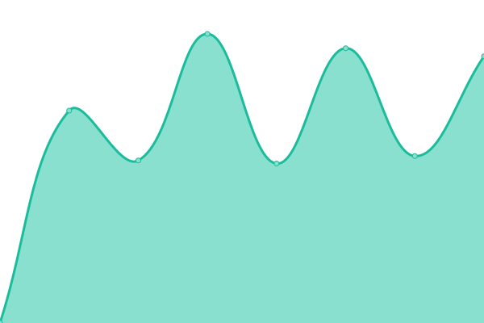 1879ms
     
 | 

<a href="https://gcommeuneidee.github.io/upptime/history/au-petit-ip">100.00%</a>
    

|  Barraco | En ligne | [barraco.yml](https://github.com/gcommeuneidee/upptime/commits/HEAD/history/barraco.yml) | 

 3892ms
     
 | 

<a href="https://gcommeuneidee.github.io/upptime/history/barraco">99.84%</a>
    

|  Beemotion | En ligne | [beemotion.yml](https://github.com/gcommeuneidee/upptime/commits/HEAD/history/beemotion.yml) | 

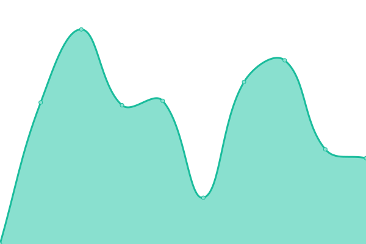 1723ms
     
 | 

<a href="https://gcommeuneidee.github.io/upptime/history/beemotion">100.00%</a>
    

|  Burotic | En ligne | [burotic.yml](https://github.com/gcommeuneidee/upptime/commits/HEAD/history/burotic.yml) | 

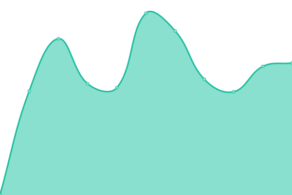 3003ms
     
 | 

<a href="https://gcommeuneidee.github.io/upptime/history/burotic">99.75%</a>
    

|  Cangey | En ligne | [cangey.yml](https://github.com/gcommeuneidee/upptime/commits/HEAD/history/cangey.yml) | 

 1738ms
     
 | 

<a href="https://gcommeuneidee.github.io/upptime/history/cangey">100.00%</a>
    

|  Chasseur sous-marin | En ligne | [chasseur-sous-marin.yml](https://github.com/gcommeuneidee/upptime/commits/HEAD/history/chasseur-sous-marin.yml) | 

 1234ms
     
 | 

<a href="https://gcommeuneidee.github.io/upptime/history/chasseur-sous-marin">99.94%</a>
    

|  Comité Handisport | En ligne | [comite-handisport.yml](https://github.com/gcommeuneidee/upptime/commits/HEAD/history/comite-handisport.yml) | 

 2229ms
     
 | 

<a href="https://gcommeuneidee.github.io/upptime/history/comite-handisport">99.79%</a>
    

|  Convergens | En ligne | [convergens.yml](https://github.com/gcommeuneidee/upptime/commits/HEAD/history/convergens.yml) | 

 2499ms
     
 | 

<a href="https://gcommeuneidee.github.io/upptime/history/convergens">100.00%</a>
    

|  Domaine de Poulaines | En ligne | [domaine-de-poulaines.yml](https://github.com/gcommeuneidee/upptime/commits/HEAD/history/domaine-de-poulaines.yml) | 

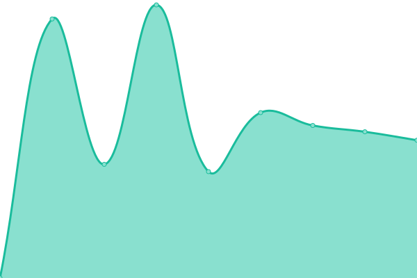 5020ms
     
 | 

<a href="https://gcommeuneidee.github.io/upptime/history/domaine-de-poulaines">99.95%</a>
    

|  G comme une idée | En ligne | [g-comme-une-idee.yml](https://github.com/gcommeuneidee/upptime/commits/HEAD/history/g-comme-une-idee.yml) | 

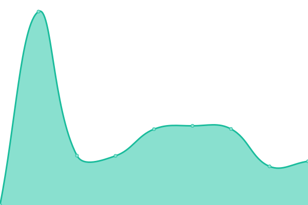 1065ms
     
 | 

<a href="https://gcommeuneidee.github.io/upptime/history/g-comme-une-idee">100.00%</a>
    

|  Gardon Mollard | En ligne | [gardon-mollard.yml](https://github.com/gcommeuneidee/upptime/commits/HEAD/history/gardon-mollard.yml) | 

 3656ms
     
 | 

<a href="https://gcommeuneidee.github.io/upptime/history/gardon-mollard">100.00%</a>
    

|  Gedo Permanence | En ligne | [gedo-permanence.yml](https://github.com/gcommeuneidee/upptime/commits/HEAD/history/gedo-permanence.yml) | 

 1123ms
     
 | 

<a href="https://gcommeuneidee.github.io/upptime/history/gedo-permanence">100.00%</a>
    

|  HandiMobile37 | En ligne | [handi-mobile37.yml](https://github.com/gcommeuneidee/upptime/commits/HEAD/history/handi-mobile37.yml) | 

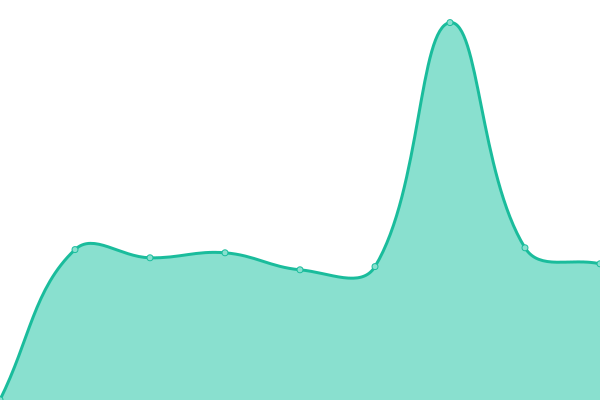 1563ms
     
 | 

<a href="https://gcommeuneidee.github.io/upptime/history/handi-mobile37">100.00%</a>
    

|  Kanyon Consulting | En ligne | [kanyon-consulting.yml](https://github.com/gcommeuneidee/upptime/commits/HEAD/history/kanyon-consulting.yml) | 

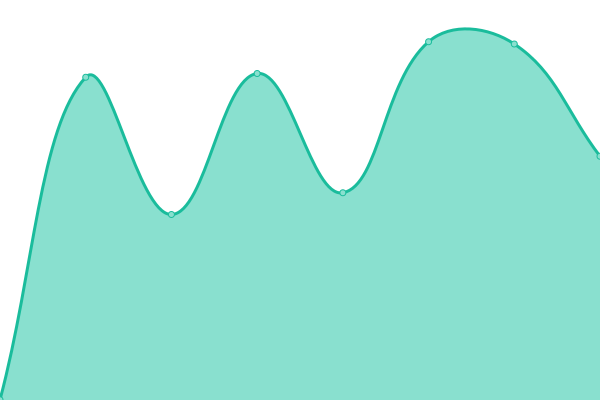 3330ms
     
 | 

<a href="https://gcommeuneidee.github.io/upptime/history/kanyon-consulting">100.00%</a>
    

|  Laiterie de Verneuil | En ligne | [laiterie-de-verneuil.yml](https://github.com/gcommeuneidee/upptime/commits/HEAD/history/laiterie-de-verneuil.yml) | 

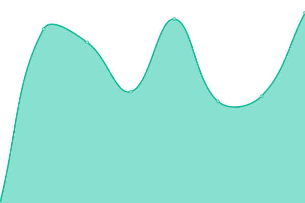 970ms
     
 | 

<a href="https://gcommeuneidee.github.io/upptime/history/laiterie-de-verneuil">100.00%</a>
    

|  Martin Fraudreau | En ligne | [martin-fraudreau.yml](https://github.com/gcommeuneidee/upptime/commits/HEAD/history/martin-fraudreau.yml) | 

 3168ms
     
 | 

<a href="https://gcommeuneidee.github.io/upptime/history/martin-fraudreau">100.00%</a>
    

|  Modern Music Academy | En ligne | [modern-music-academy.yml](https://github.com/gcommeuneidee/upptime/commits/HEAD/history/modern-music-academy.yml) | 

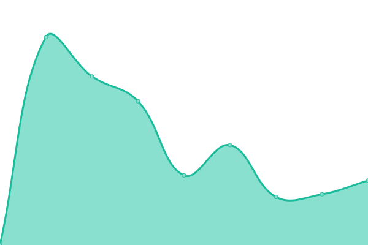 1615ms
     
 | 

<a href="https://gcommeuneidee.github.io/upptime/history/modern-music-academy">100.00%</a>
    

|  Numaterra | En ligne | [numaterra.yml](https://github.com/gcommeuneidee/upptime/commits/HEAD/history/numaterra.yml) | 

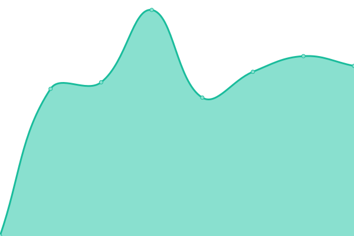 1028ms
     
 | 

<a href="https://gcommeuneidee.github.io/upptime/history/numaterra">100.00%</a>
    

|  Phone Services | En ligne | [phone-services.yml](https://github.com/gcommeuneidee/upptime/commits/HEAD/history/phone-services.yml) | 

 4631ms
     
 | 

<a href="https://gcommeuneidee.github.io/upptime/history/phone-services">99.74%</a>
    

|  RDV Internet | En ligne | [rdv-internet.yml](https://github.com/gcommeuneidee/upptime/commits/HEAD/history/rdv-internet.yml) | 

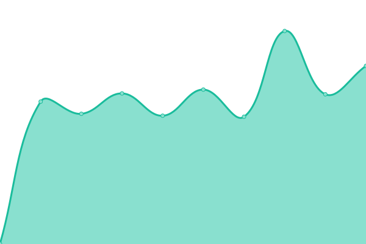 947ms
     
 | 

<a href="https://gcommeuneidee.github.io/upptime/history/rdv-internet">100.00%</a>
    

|  Rotowash | En ligne | [rotowash.yml](https://github.com/gcommeuneidee/upptime/commits/HEAD/history/rotowash.yml) | 

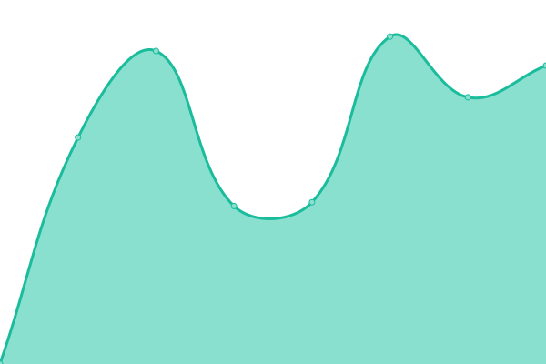 1693ms
     
 | 

<a href="https://gcommeuneidee.github.io/upptime/history/rotowash">100.00%</a>
    

|  Saint-Ouen-les-Vignes | En ligne | [saint-ouen-les-vignes.yml](https://github.com/gcommeuneidee/upptime/commits/HEAD/history/saint-ouen-les-vignes.yml) | 

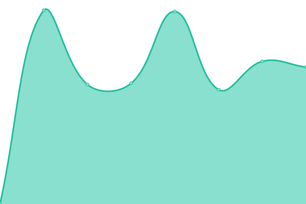 968ms
     
 | 

<a href="https://gcommeuneidee.github.io/upptime/history/saint-ouen-les-vignes">100.00%</a>
    

|  Sennegon | En ligne | [sennegon.yml](https://github.com/gcommeuneidee/upptime/commits/HEAD/history/sennegon.yml) | 

 2084ms
     
 | 

<a href="https://gcommeuneidee.github.io/upptime/history/sennegon">100.00%</a>
    

|  Weser | En ligne | [weser.yml](https://github.com/gcommeuneidee/upptime/commits/HEAD/history/weser.yml) | 

 3175ms
     
 | 

<a href="https://gcommeuneidee.github.io/upptime/history/weser">100.00%</a>
    

|  Yona Design | En ligne | [yona-design.yml](https://github.com/gcommeuneidee/upptime/commits/HEAD/history/yona-design.yml) | 

 1921ms
     
 | 

<a href="https://gcommeuneidee.github.io/upptime/history/yona-design">100.00%</a>
    

<!--end: status pages-->

[**Visit our status website →**](https://upptime.github.io/upptime)

## 📄 License

- Powered by: [Upptime](https://github.com/upptime/upptime)
- Code: [MIT](./LICENSE) © [Upptime](https://upptime.js.org)
- Data in the `./history` directory: [Open Database License](https://opendatacommons.org/licenses/odbl/1-0/)
