# [📈 Live Status](https://upptime.github.io/upptime): <!--live status--> **🟧 Panne partielle**

This repository contains the open-source uptime monitor and status page for [Upptime](https://upptime.js.org), powered by [Upptime](https://github.com/upptime/upptime).

With [Upptime](https://upptime.js.org), you can get your own unlimited and free uptime monitor and status page, powered entirely by a GitHub repository. We use [Issues](https://github.com/upptime/upptime/issues) as incident reports, [Actions](https://github.com/gcommeuneidee/upptime/actions) as uptime monitors, and [Pages](https://upptime.github.io/upptime) for the status page.

<!--start: status pages-->
<!-- This summary is generated by Upptime (https://github.com/upptime/upptime) -->
<!-- Do not edit this manually, your changes will be overwritten -->
<!-- prettier-ignore -->
| URL | Statut | Historique | Temps de réponse | Disponibilité |
| --- | ------ | ------- | ------------- | ------ |
|  Académie de la Truffe | En ligne | [academie-de-la-truffe.yml](https://github.com/gcommeuneidee/upptime/commits/HEAD/history/academie-de-la-truffe.yml) | 

 871ms
     
 | 

<a href="https://gcommeuneidee.github.io/upptime/history/academie-de-la-truffe">99.52%</a>
    

|  Agence CMS | En ligne | [agence-cms.yml](https://github.com/gcommeuneidee/upptime/commits/HEAD/history/agence-cms.yml) | 

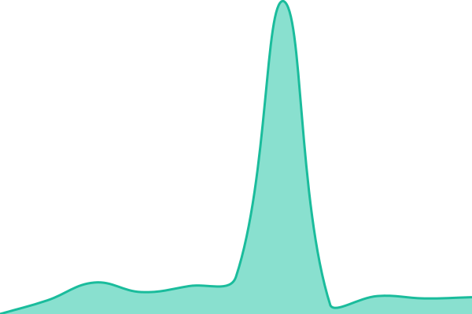 1137ms
     
 | 

<a href="https://gcommeuneidee.github.io/upptime/history/agence-cms">99.53%</a>
    

|  ARAPI Autisme | En ligne | [arapi-autisme.yml](https://github.com/gcommeuneidee/upptime/commits/HEAD/history/arapi-autisme.yml) | 

 1264ms
     
 | 

<a href="https://gcommeuneidee.github.io/upptime/history/arapi-autisme">98.83%</a>
    

|  ARAPI Gestion | Hors ligne | [arapi-gestion.yml](https://github.com/gcommeuneidee/upptime/commits/HEAD/history/arapi-gestion.yml) | 

 100ms
     
 | 

<a href="https://gcommeuneidee.github.io/upptime/history/arapi-gestion">0.00%</a>
    

|  ARAPI Université | En ligne | [arapi-universite.yml](https://github.com/gcommeuneidee/upptime/commits/HEAD/history/arapi-universite.yml) | 

 835ms
     
 | 

<a href="https://gcommeuneidee.github.io/upptime/history/arapi-universite">99.16%</a>
    

|  AuPetit IP | En ligne | [au-petit-ip.yml](https://github.com/gcommeuneidee/upptime/commits/HEAD/history/au-petit-ip.yml) | 

 2645ms
     
 | 

<a href="https://gcommeuneidee.github.io/upptime/history/au-petit-ip">100.00%</a>
    

|  Alterpaint | En ligne | [alterpaint.yml](https://github.com/gcommeuneidee/upptime/commits/HEAD/history/alterpaint.yml) | 

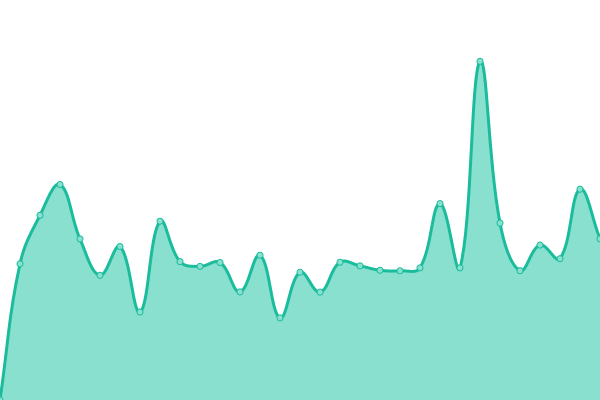 1098ms
     
 | 

<a href="https://gcommeuneidee.github.io/upptime/history/alterpaint">97.61%</a>
    

|  Aventa | En ligne | [aventa.yml](https://github.com/gcommeuneidee/upptime/commits/HEAD/history/aventa.yml) | 

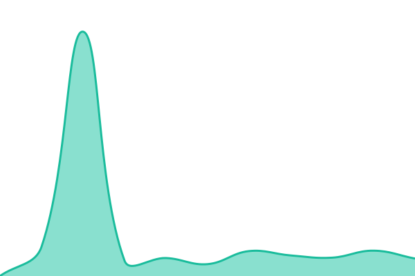 1160ms
     
 | 

<a href="https://gcommeuneidee.github.io/upptime/history/aventa">97.19%</a>
    

|  Barraco | Hors ligne | [barraco.yml](https://github.com/gcommeuneidee/upptime/commits/HEAD/history/barraco.yml) | 

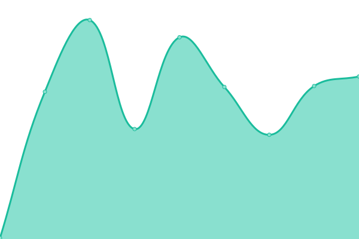 149ms
     
 | 

<a href="https://gcommeuneidee.github.io/upptime/history/barraco">0.00%</a>
    

|  Beemotion | En ligne | [beemotion.yml](https://github.com/gcommeuneidee/upptime/commits/HEAD/history/beemotion.yml) | 

 1840ms
     
 | 

<a href="https://gcommeuneidee.github.io/upptime/history/beemotion">99.73%</a>
    

|  Bureau21 | En ligne | [bureau21.yml](https://github.com/gcommeuneidee/upptime/commits/HEAD/history/bureau21.yml) | 

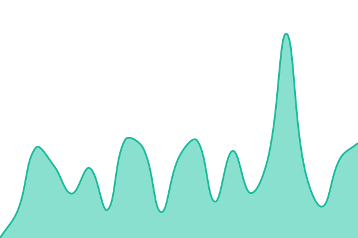 850ms
     
 | 

<a href="https://gcommeuneidee.github.io/upptime/history/bureau21">97.61%</a>
    

|  Cangey | En ligne | [cangey.yml](https://github.com/gcommeuneidee/upptime/commits/HEAD/history/cangey.yml) | 

 769ms
     
 | 

<a href="https://gcommeuneidee.github.io/upptime/history/cangey">99.73%</a>
    

|  Céline da Graça Pires | En ligne | [celine-da-graca-pires.yml](https://github.com/gcommeuneidee/upptime/commits/HEAD/history/celine-da-graca-pires.yml) | 

 1672ms
     
 | 

<a href="https://gcommeuneidee.github.io/upptime/history/celine-da-graca-pires">98.61%</a>
    

|  Chasseur sous-marin | En ligne | [chasseur-sous-marin.yml](https://github.com/gcommeuneidee/upptime/commits/HEAD/history/chasseur-sous-marin.yml) | 

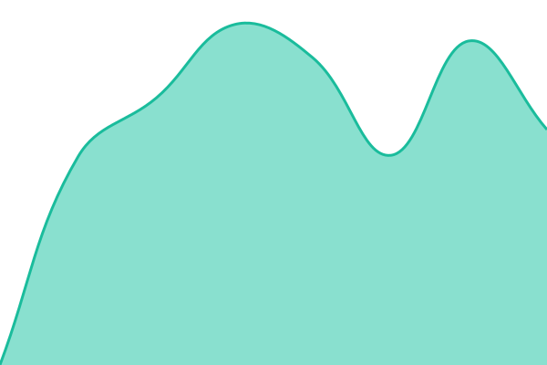 1049ms
     
 | 

<a href="https://gcommeuneidee.github.io/upptime/history/chasseur-sous-marin">100.00%</a>
    

|  Convergens | En ligne | [convergens.yml](https://github.com/gcommeuneidee/upptime/commits/HEAD/history/convergens.yml) | 

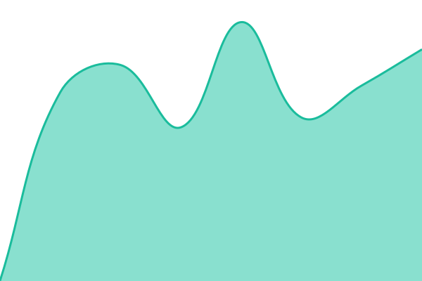 1201ms
     
 | 

<a href="https://gcommeuneidee.github.io/upptime/history/convergens">100.00%</a>
    

|  Copelva | En ligne | [copelva.yml](https://github.com/gcommeuneidee/upptime/commits/HEAD/history/copelva.yml) | 

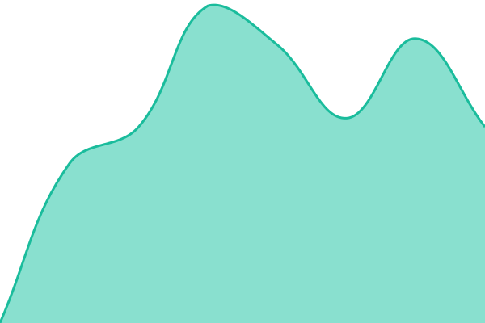 1227ms
     
 | 

<a href="https://gcommeuneidee.github.io/upptime/history/copelva">100.00%</a>
    

|  Degrav'Agri | En ligne | [degrav-agri.yml](https://github.com/gcommeuneidee/upptime/commits/HEAD/history/degrav-agri.yml) | 

 866ms
     
 | 

<a href="https://gcommeuneidee.github.io/upptime/history/degrav-agri">99.73%</a>
    

|  Devin Collection | En ligne | [devin-collection.yml](https://github.com/gcommeuneidee/upptime/commits/HEAD/history/devin-collection.yml) | 

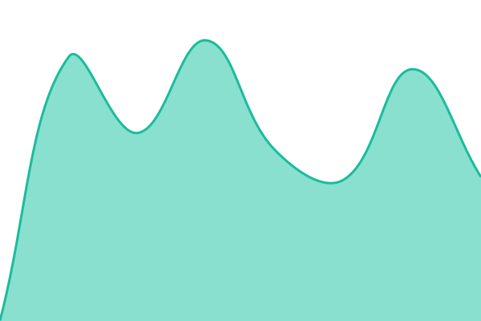 413ms
     
 | 

<a href="https://gcommeuneidee.github.io/upptime/history/devin-collection">100.00%</a>
    

|  Domaine de Poulaines | En ligne | [domaine-de-poulaines.yml](https://github.com/gcommeuneidee/upptime/commits/HEAD/history/domaine-de-poulaines.yml) | 

 2531ms
     
 | 

<a href="https://gcommeuneidee.github.io/upptime/history/domaine-de-poulaines">99.74%</a>
    

|  G comme une idée | En ligne | [g-comme-une-idee.yml](https://github.com/gcommeuneidee/upptime/commits/HEAD/history/g-comme-une-idee.yml) | 

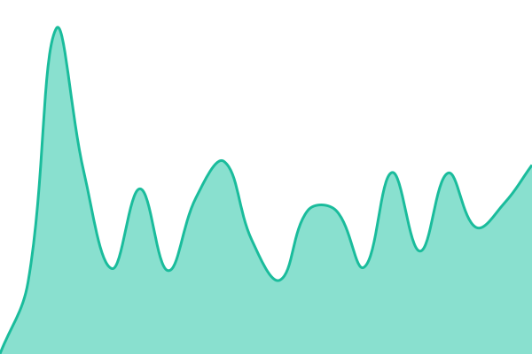 542ms
     
 | 

<a href="https://gcommeuneidee.github.io/upptime/history/g-comme-une-idee">97.62%</a>
    

|  Gardon Mollard | En ligne | [gardon-mollard.yml](https://github.com/gcommeuneidee/upptime/commits/HEAD/history/gardon-mollard.yml) | 

 1168ms
     
 | 

<a href="https://gcommeuneidee.github.io/upptime/history/gardon-mollard">99.74%</a>
    

|  Gedo Permanence | En ligne | [gedo-permanence.yml](https://github.com/gcommeuneidee/upptime/commits/HEAD/history/gedo-permanence.yml) | 

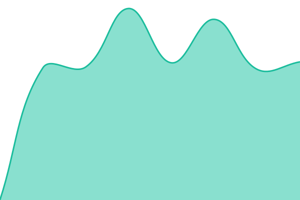 1077ms
     
 | 

<a href="https://gcommeuneidee.github.io/upptime/history/gedo-permanence">100.00%</a>
    

|  Geocean | En ligne | [geocean.yml](https://github.com/gcommeuneidee/upptime/commits/HEAD/history/geocean.yml) | 

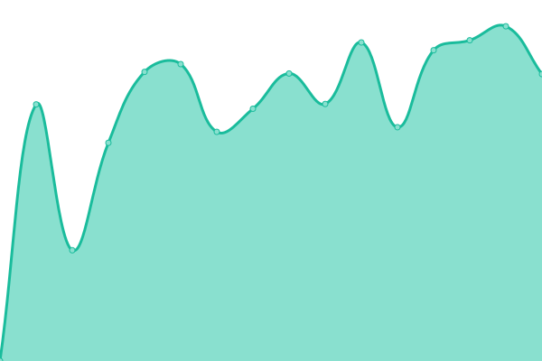 1978ms
     
 | 

<a href="https://gcommeuneidee.github.io/upptime/history/geocean">98.10%</a>
    

|  HandiMobile37 | En ligne | [handi-mobile37.yml](https://github.com/gcommeuneidee/upptime/commits/HEAD/history/handi-mobile37.yml) | 

 1170ms
     
 | 

<a href="https://gcommeuneidee.github.io/upptime/history/handi-mobile37">99.78%</a>
    

|  Inclusion | En ligne | [inclusion.yml](https://github.com/gcommeuneidee/upptime/commits/HEAD/history/inclusion.yml) | 

 1760ms
     
 | 

<a href="https://gcommeuneidee.github.io/upptime/history/inclusion">97.86%</a>
    

|  Inovamed | En ligne | [inovamed.yml](https://github.com/gcommeuneidee/upptime/commits/HEAD/history/inovamed.yml) | 

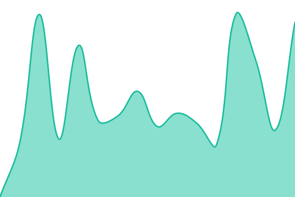 782ms
     
 | 

<a href="https://gcommeuneidee.github.io/upptime/history/inovamed">97.62%</a>
    

|  Kanyon Consulting | En ligne | [kanyon-consulting.yml](https://github.com/gcommeuneidee/upptime/commits/HEAD/history/kanyon-consulting.yml) | 

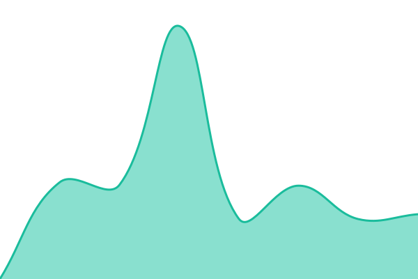 1179ms
     
 | 

<a href="https://gcommeuneidee.github.io/upptime/history/kanyon-consulting">99.74%</a>
    

|  Kraken Subsea | En ligne | [kraken-subsea.yml](https://github.com/gcommeuneidee/upptime/commits/HEAD/history/kraken-subsea.yml) | 

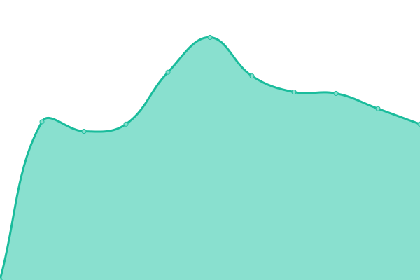 1401ms
     
 | 

<a href="https://gcommeuneidee.github.io/upptime/history/kraken-subsea">99.75%</a>
    

|  Laiterie de Verneuil | En ligne | [laiterie-de-verneuil.yml](https://github.com/gcommeuneidee/upptime/commits/HEAD/history/laiterie-de-verneuil.yml) | 

 715ms
     
 | 

<a href="https://gcommeuneidee.github.io/upptime/history/laiterie-de-verneuil">99.75%</a>
    

|  Leggerini Gravure | En ligne | [leggerini-gravure.yml](https://github.com/gcommeuneidee/upptime/commits/HEAD/history/leggerini-gravure.yml) | 

 792ms
     
 | 

<a href="https://gcommeuneidee.github.io/upptime/history/leggerini-gravure">99.75%</a>
    

|  Nerio | En ligne | [nerio.yml](https://github.com/gcommeuneidee/upptime/commits/HEAD/history/nerio.yml) | 

 1607ms
     
 | 

<a href="https://gcommeuneidee.github.io/upptime/history/nerio">99.76%</a>
    

|  Nudjy | En ligne | [nudjy.yml](https://github.com/gcommeuneidee/upptime/commits/HEAD/history/nudjy.yml) | 

 1159ms
     
 | 

<a href="https://gcommeuneidee.github.io/upptime/history/nudjy">100.00%</a>
    

|  Numaterra | En ligne | [numaterra.yml](https://github.com/gcommeuneidee/upptime/commits/HEAD/history/numaterra.yml) | 

 1016ms
     
 | 

<a href="https://gcommeuneidee.github.io/upptime/history/numaterra">100.00%</a>
    

|  PAM Conseil | En ligne | [pam-conseil.yml](https://github.com/gcommeuneidee/upptime/commits/HEAD/history/pam-conseil.yml) | 

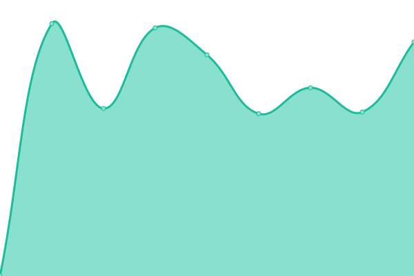 659ms
     
 | 

<a href="https://gcommeuneidee.github.io/upptime/history/pam-conseil">99.76%</a>
    

|  RDV Internet | En ligne | [rdv-internet.yml](https://github.com/gcommeuneidee/upptime/commits/HEAD/history/rdv-internet.yml) | 

 831ms
     
 | 

<a href="https://gcommeuneidee.github.io/upptime/history/rdv-internet">99.86%</a>
    

|  Resallience | En ligne | [resallience.yml](https://github.com/gcommeuneidee/upptime/commits/HEAD/history/resallience.yml) | 

 714ms
     
 | 

<a href="https://gcommeuneidee.github.io/upptime/history/resallience">99.76%</a>
    

|  Restaurant Les Jardiniers | En ligne | [restaurant-les-jardiniers.yml](https://github.com/gcommeuneidee/upptime/commits/HEAD/history/restaurant-les-jardiniers.yml) | 

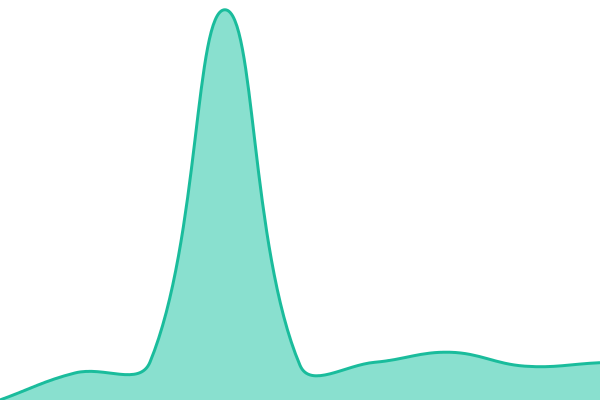 731ms
     
 | 

<a href="https://gcommeuneidee.github.io/upptime/history/restaurant-les-jardiniers">99.54%</a>
    

|  Saint-Ouen-les-Vignes | En ligne | [saint-ouen-les-vignes.yml](https://github.com/gcommeuneidee/upptime/commits/HEAD/history/saint-ouen-les-vignes.yml) | 

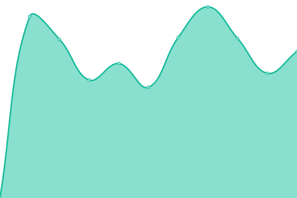 1032ms
     
 | 

<a href="https://gcommeuneidee.github.io/upptime/history/saint-ouen-les-vignes">99.76%</a>
    

|  Socom Comparateur | En ligne | [socom-comparateur.yml](https://github.com/gcommeuneidee/upptime/commits/HEAD/history/socom-comparateur.yml) | 

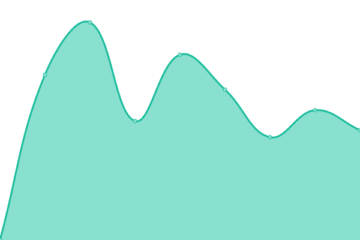 1316ms
     
 | 

<a href="https://gcommeuneidee.github.io/upptime/history/socom-comparateur">99.77%</a>
    

|  Tours Métropole Basket PLL | En ligne | [tours-metropole-basket-pll.yml](https://github.com/gcommeuneidee/upptime/commits/HEAD/history/tours-metropole-basket-pll.yml) | 

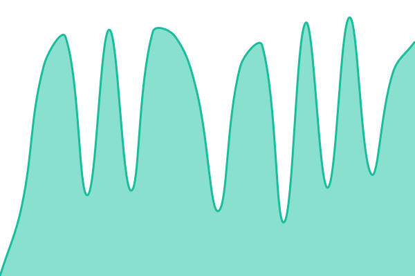 1242ms
     
 | 

<a href="https://gcommeuneidee.github.io/upptime/history/tours-metropole-basket-pll">97.62%</a>
    

|  Weser | En ligne | [weser.yml](https://github.com/gcommeuneidee/upptime/commits/HEAD/history/weser.yml) | 

 746ms
     
 | 

<a href="https://gcommeuneidee.github.io/upptime/history/weser">99.77%</a>
    

|  Yona Design | En ligne | [yona-design.yml](https://github.com/gcommeuneidee/upptime/commits/HEAD/history/yona-design.yml) | 

 1310ms
     
 | 

<a href="https://gcommeuneidee.github.io/upptime/history/yona-design">99.54%</a>
    

<!--end: status pages-->

[**Visit our status website →**](https://upptime.github.io/upptime)

## 📄 License

- Powered by: [Upptime](https://github.com/upptime/upptime)
- Code: [MIT](./LICENSE) © [Upptime](https://upptime.js.org)
- Data in the `./history` directory: [Open Database License](https://opendatacommons.org/licenses/odbl/1-0/)
