# [📈 Live Status](https://upptime.github.io/upptime): <!--live status--> **🟧 Panne partielle**

This repository contains the open-source uptime monitor and status page for [Upptime](https://upptime.js.org), powered by [Upptime](https://github.com/upptime/upptime).

With [Upptime](https://upptime.js.org), you can get your own unlimited and free uptime monitor and status page, powered entirely by a GitHub repository. We use [Issues](https://github.com/upptime/upptime/issues) as incident reports, [Actions](https://github.com/gcommeuneidee/upptime/actions) as uptime monitors, and [Pages](https://upptime.github.io/upptime) for the status page.

<!--start: status pages-->
<!-- This summary is generated by Upptime (https://github.com/upptime/upptime) -->
<!-- Do not edit this manually, your changes will be overwritten -->
<!-- prettier-ignore -->
| URL | Statut | Historique | Temps de réponse | Disponibilité |
| --- | ------ | ------- | ------------- | ------ |
|  Académie de la Truffe | Hors ligne | [academie-de-la-truffe.yml](https://github.com/gcommeuneidee/upptime/commits/HEAD/history/academie-de-la-truffe.yml) | 

 0ms
     
 | 

<a href="https://gcommeuneidee.github.io/upptime/history/academie-de-la-truffe">0.00%</a>
    

|  Agence CMS | En ligne | [agence-cms.yml](https://github.com/gcommeuneidee/upptime/commits/HEAD/history/agence-cms.yml) | 

 1439ms
     
 | 

<a href="https://gcommeuneidee.github.io/upptime/history/agence-cms">100.00%</a>
    

|  ARAPI Autisme | En ligne | [arapi-autisme.yml](https://github.com/gcommeuneidee/upptime/commits/HEAD/history/arapi-autisme.yml) | 

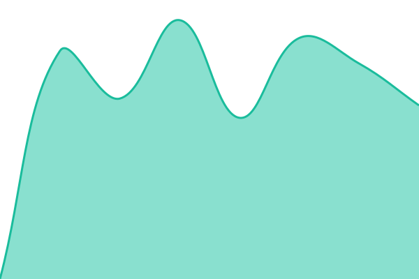 1448ms
     
 | 

<a href="https://gcommeuneidee.github.io/upptime/history/arapi-autisme">100.00%</a>
    

|  ARAPI Gestion | Hors ligne | [arapi-gestion.yml](https://github.com/gcommeuneidee/upptime/commits/HEAD/history/arapi-gestion.yml) | 

 766ms
     
 | 

<a href="https://gcommeuneidee.github.io/upptime/history/arapi-gestion">0.00%</a>
    

|  ARAPI Université | En ligne | [arapi-universite.yml](https://github.com/gcommeuneidee/upptime/commits/HEAD/history/arapi-universite.yml) | 

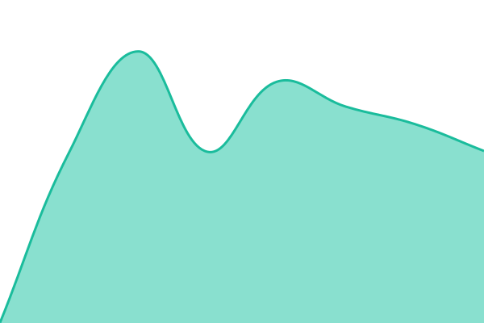 960ms
     
 | 

<a href="https://gcommeuneidee.github.io/upptime/history/arapi-universite">100.00%</a>
    

|  AuPetit IP | En ligne | [au-petit-ip.yml](https://github.com/gcommeuneidee/upptime/commits/HEAD/history/au-petit-ip.yml) | 

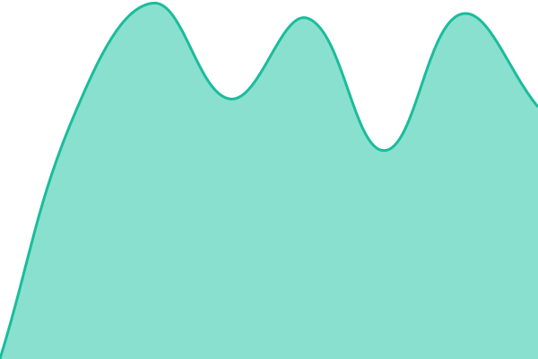 1210ms
     
 | 

<a href="https://gcommeuneidee.github.io/upptime/history/au-petit-ip">100.00%</a>
    

|  Alterpaint | En ligne | [alterpaint.yml](https://github.com/gcommeuneidee/upptime/commits/HEAD/history/alterpaint.yml) | 

 1365ms
     
 | 

<a href="https://gcommeuneidee.github.io/upptime/history/alterpaint">100.00%</a>
    

|  Aventa | En ligne | [aventa.yml](https://github.com/gcommeuneidee/upptime/commits/HEAD/history/aventa.yml) | 

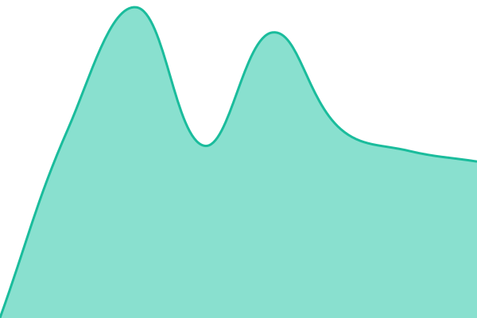 1472ms
     
 | 

<a href="https://gcommeuneidee.github.io/upptime/history/aventa">100.00%</a>
    

|  Beemotion | En ligne | [beemotion.yml](https://github.com/gcommeuneidee/upptime/commits/HEAD/history/beemotion.yml) | 

 2100ms
     
 | 

<a href="https://gcommeuneidee.github.io/upptime/history/beemotion">100.00%</a>
    

|  Bureau21 | En ligne | [bureau21.yml](https://github.com/gcommeuneidee/upptime/commits/HEAD/history/bureau21.yml) | 

 1259ms
     
 | 

<a href="https://gcommeuneidee.github.io/upptime/history/bureau21">100.00%</a>
    

|  Cangey | En ligne | [cangey.yml](https://github.com/gcommeuneidee/upptime/commits/HEAD/history/cangey.yml) | 

 954ms
     
 | 

<a href="https://gcommeuneidee.github.io/upptime/history/cangey">100.00%</a>
    

|  Céline da Graça Pires | En ligne | [celine-da-graca-pires.yml](https://github.com/gcommeuneidee/upptime/commits/HEAD/history/celine-da-graca-pires.yml) | 

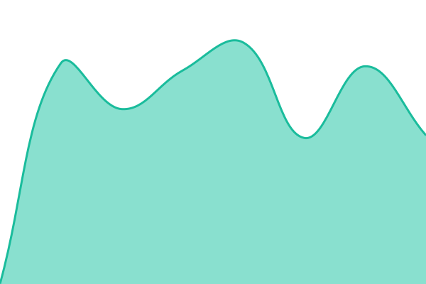 821ms
     
 | 

<a href="https://gcommeuneidee.github.io/upptime/history/celine-da-graca-pires">100.00%</a>
    

|  Chasseur sous-marin | En ligne | [chasseur-sous-marin.yml](https://github.com/gcommeuneidee/upptime/commits/HEAD/history/chasseur-sous-marin.yml) | 

 1431ms
     
 | 

<a href="https://gcommeuneidee.github.io/upptime/history/chasseur-sous-marin">100.00%</a>
    

|  Convergens | En ligne | [convergens.yml](https://github.com/gcommeuneidee/upptime/commits/HEAD/history/convergens.yml) | 

 1077ms
     
 | 

<a href="https://gcommeuneidee.github.io/upptime/history/convergens">100.00%</a>
    

|  Copelva | En ligne | [copelva.yml](https://github.com/gcommeuneidee/upptime/commits/HEAD/history/copelva.yml) | 

 1541ms
     
 | 

<a href="https://gcommeuneidee.github.io/upptime/history/copelva">100.00%</a>
    

|  Degrav'Agri | En ligne | [degrav-agri.yml](https://github.com/gcommeuneidee/upptime/commits/HEAD/history/degrav-agri.yml) | 

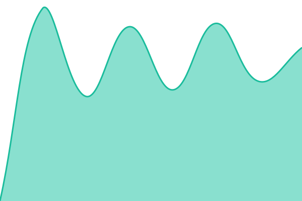 1105ms
     
 | 

<a href="https://gcommeuneidee.github.io/upptime/history/degrav-agri">100.00%</a>
    

|  Devin Collection | En ligne | [devin-collection.yml](https://github.com/gcommeuneidee/upptime/commits/HEAD/history/devin-collection.yml) | 

 553ms
     
 | 

<a href="https://gcommeuneidee.github.io/upptime/history/devin-collection">100.00%</a>
    

|  Domaine de Poulaines | En ligne | [domaine-de-poulaines.yml](https://github.com/gcommeuneidee/upptime/commits/HEAD/history/domaine-de-poulaines.yml) | 

 3248ms
     
 | 

<a href="https://gcommeuneidee.github.io/upptime/history/domaine-de-poulaines">100.00%</a>
    

|  G comme une idée | En ligne | [g-comme-une-idee.yml](https://github.com/gcommeuneidee/upptime/commits/HEAD/history/g-comme-une-idee.yml) | 

 910ms
     
 | 

<a href="https://gcommeuneidee.github.io/upptime/history/g-comme-une-idee">100.00%</a>
    

|  Gardon Mollard | En ligne | [gardon-mollard.yml](https://github.com/gcommeuneidee/upptime/commits/HEAD/history/gardon-mollard.yml) | 

 1867ms
     
 | 

<a href="https://gcommeuneidee.github.io/upptime/history/gardon-mollard">100.00%</a>
    

|  Gedo Permanence | En ligne | [gedo-permanence.yml](https://github.com/gcommeuneidee/upptime/commits/HEAD/history/gedo-permanence.yml) | 

 1015ms
     
 | 

<a href="https://gcommeuneidee.github.io/upptime/history/gedo-permanence">100.00%</a>
    

|  Geocean | En ligne | [geocean.yml](https://github.com/gcommeuneidee/upptime/commits/HEAD/history/geocean.yml) | 

 1857ms
     
 | 

<a href="https://gcommeuneidee.github.io/upptime/history/geocean">83.23%</a>
    

|  HandiMobile37 | En ligne | [handi-mobile37.yml](https://github.com/gcommeuneidee/upptime/commits/HEAD/history/handi-mobile37.yml) | 

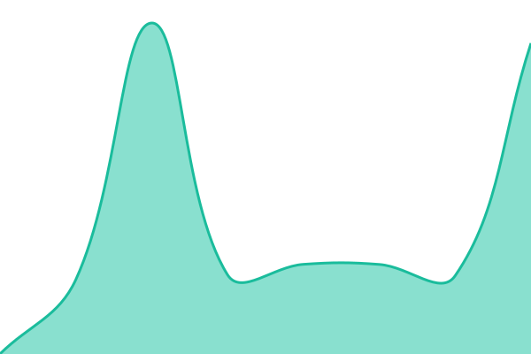 784ms
     
 | 

<a href="https://gcommeuneidee.github.io/upptime/history/handi-mobile37">97.84%</a>
    

|  Inovamed | En ligne | [inovamed.yml](https://github.com/gcommeuneidee/upptime/commits/HEAD/history/inovamed.yml) | 

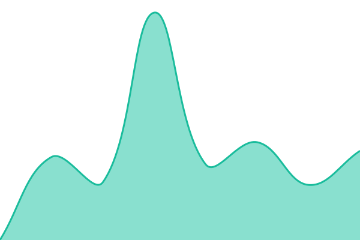 1746ms
     
 | 

<a href="https://gcommeuneidee.github.io/upptime/history/inovamed">100.00%</a>
    

|  Kanyon Consulting | En ligne | [kanyon-consulting.yml](https://github.com/gcommeuneidee/upptime/commits/HEAD/history/kanyon-consulting.yml) | 

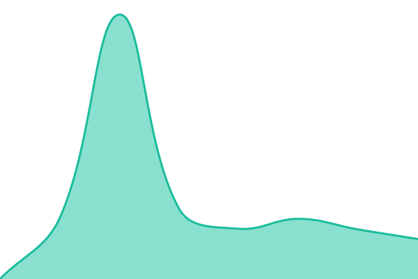 1289ms
     
 | 

<a href="https://gcommeuneidee.github.io/upptime/history/kanyon-consulting">100.00%</a>
    

|  Kraken Subsea | En ligne | [kraken-subsea.yml](https://github.com/gcommeuneidee/upptime/commits/HEAD/history/kraken-subsea.yml) | 

 3604ms
     
 | 

<a href="https://gcommeuneidee.github.io/upptime/history/kraken-subsea">100.00%</a>
    

|  Laiterie de Verneuil | En ligne | [laiterie-de-verneuil.yml](https://github.com/gcommeuneidee/upptime/commits/HEAD/history/laiterie-de-verneuil.yml) | 

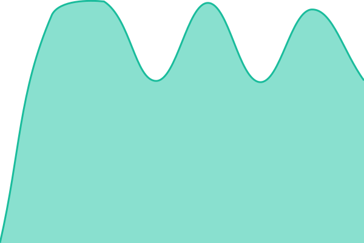 857ms
     
 | 

<a href="https://gcommeuneidee.github.io/upptime/history/laiterie-de-verneuil">100.00%</a>
    

|  Leggerini Gravure | En ligne | [leggerini-gravure.yml](https://github.com/gcommeuneidee/upptime/commits/HEAD/history/leggerini-gravure.yml) | 

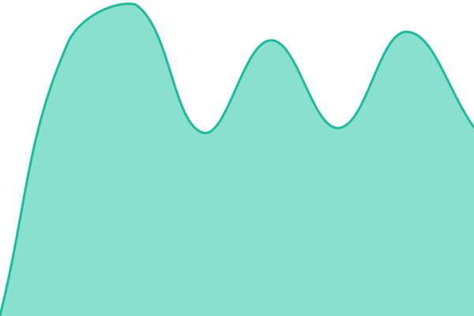 984ms
     
 | 

<a href="https://gcommeuneidee.github.io/upptime/history/leggerini-gravure">100.00%</a>
    

|  Nerio | En ligne | [nerio.yml](https://github.com/gcommeuneidee/upptime/commits/HEAD/history/nerio.yml) | 

 1810ms
     
 | 

<a href="https://gcommeuneidee.github.io/upptime/history/nerio">100.00%</a>
    

|  Nudjy | En ligne | [nudjy.yml](https://github.com/gcommeuneidee/upptime/commits/HEAD/history/nudjy.yml) | 

 1024ms
     
 | 

<a href="https://gcommeuneidee.github.io/upptime/history/nudjy">100.00%</a>
    

|  Numaterra | En ligne | [numaterra.yml](https://github.com/gcommeuneidee/upptime/commits/HEAD/history/numaterra.yml) | 

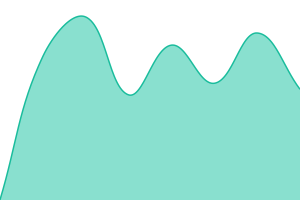 1030ms
     
 | 

<a href="https://gcommeuneidee.github.io/upptime/history/numaterra">100.00%</a>
    

|  RDV Internet | En ligne | [rdv-internet.yml](https://github.com/gcommeuneidee/upptime/commits/HEAD/history/rdv-internet.yml) | 

 920ms
     
 | 

<a href="https://gcommeuneidee.github.io/upptime/history/rdv-internet">100.00%</a>
    

|  Resallience | En ligne | [resallience.yml](https://github.com/gcommeuneidee/upptime/commits/HEAD/history/resallience.yml) | 

 924ms
     
 | 

<a href="https://gcommeuneidee.github.io/upptime/history/resallience">100.00%</a>
    

|  Restaurant Les Jardiniers | En ligne | [restaurant-les-jardiniers.yml](https://github.com/gcommeuneidee/upptime/commits/HEAD/history/restaurant-les-jardiniers.yml) | 

 5022ms
     
 | 

<a href="https://gcommeuneidee.github.io/upptime/history/restaurant-les-jardiniers">100.00%</a>
    

|  Saint-Ouen-les-Vignes | En ligne | [saint-ouen-les-vignes.yml](https://github.com/gcommeuneidee/upptime/commits/HEAD/history/saint-ouen-les-vignes.yml) | 

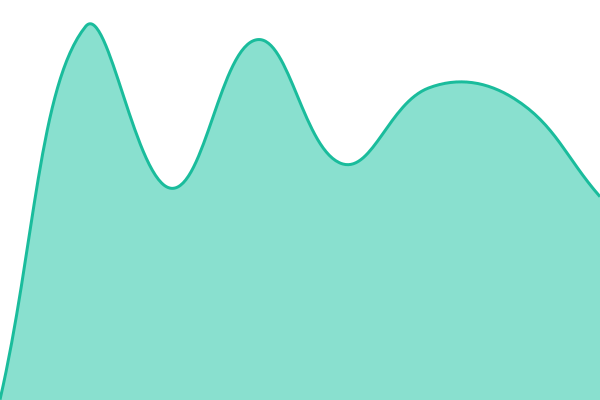 981ms
     
 | 

<a href="https://gcommeuneidee.github.io/upptime/history/saint-ouen-les-vignes">100.00%</a>
    

|  Tours Métropole Basket PLL | En ligne | [tours-metropole-basket-pll.yml](https://github.com/gcommeuneidee/upptime/commits/HEAD/history/tours-metropole-basket-pll.yml) | 

 1759ms
     
 | 

<a href="https://gcommeuneidee.github.io/upptime/history/tours-metropole-basket-pll">100.00%</a>
    

|  Weser | En ligne | [weser.yml](https://github.com/gcommeuneidee/upptime/commits/HEAD/history/weser.yml) | 

 941ms
     
 | 

<a href="https://gcommeuneidee.github.io/upptime/history/weser">100.00%</a>
    

<!--end: status pages-->

[**Visit our status website →**](https://upptime.github.io/upptime)

## 📄 License

- Powered by: [Upptime](https://github.com/upptime/upptime)
- Code: [MIT](./LICENSE) © [Upptime](https://upptime.js.org)
- Data in the `./history` directory: [Open Database License](https://opendatacommons.org/licenses/odbl/1-0/)
